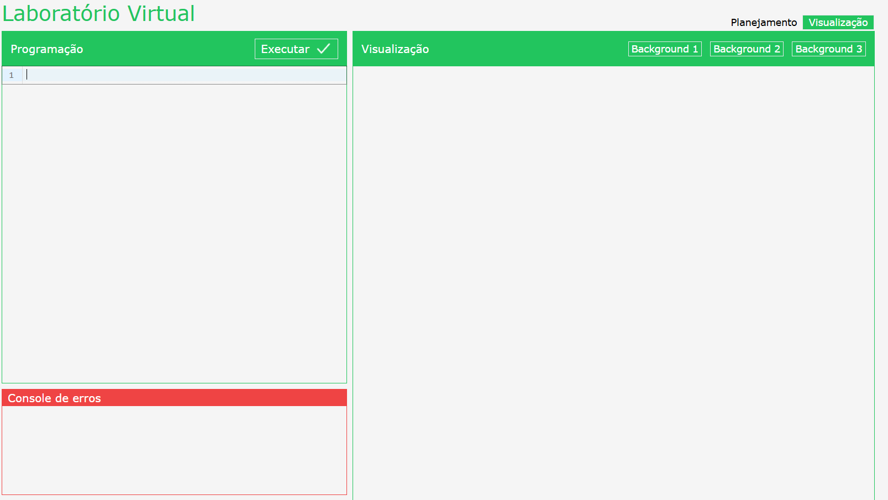

# Simucar Virtual

Simucar é um laboratório virtual interativo para aprendizado de programação e robótica. 



## Tecnologias Utilizadas

- **Vue.js**: Framework JavaScript progressivo para construção de interfaces de usuário.
- **Pinia**: Biblioteca de gerenciamento de estado para Vue.js.
- **Vue Router**: Roteador oficial do Vue.js para construção de single-page applications.
- **CodeMirror**: Editor de código embutido que oferece suporte a múltiplas linguagens de programação.

## Funcionalidades Principais

- **Autenticação de Usuário**: Sistema de login e registro para acesso personalizado.
- **Execução de Código em Tempo Real**: Permite que os usuários escrevam e executem código instantaneamente no ambiente virtual.
- **Console de Erros**: Ferramenta de depuração que exibe mensagens de erro e ajuda na identificação de problemas no código.

## Instalação e Execução

Para rodar o projeto localmente, siga os passos abaixo:

1. **Clone o repositório**:

   ```bash
   git clone https://github.com/ThiagoViana07/simucar-virtual.git
   ```

2. **Navegue até o diretório do projeto**:

   ```bash
   cd simucar-virtual
   ```

3. **Instale as dependências**:

   ```bash
   npm install
   ```

4. **Inicie o servidor de desenvolvimento**:

   ```bash
   npm run dev
   ```

O aplicativo estará disponível em `http://localhost:3000`.

## Estrutura do Projeto

- **`src/`**: Contém os arquivos fonte do projeto.
  - **`components/`**: Componentes Vue reutilizáveis.
  - **`views/`**: Páginas e visualizações principais.
  - **`store/`**: Configuração do Pinia para gerenciamento de estado.
  - **`router/`**: Configuração das rotas do Vue Router.
- **`public/`**: Arquivos públicos estáticos.
- **`package.json`**: Arquivo de configuração do npm com scripts e dependências.

## Contribuição

Contribuições são bem-vindas! Sinta-se à vontade para abrir issues e pull requests.

## Licença

Este projeto está licenciado sob a licença MIT. Veja o arquivo `LICENSE` para mais detalhes.

---

 
